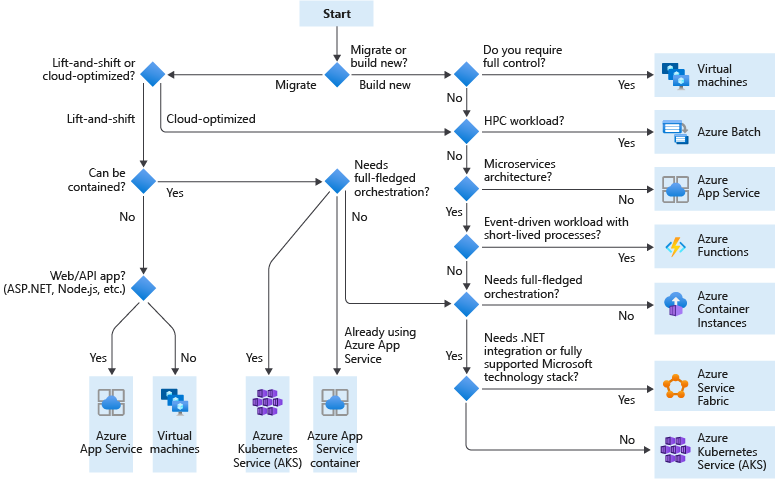

# IaaS and SaaS

## Understand the hosting models

### Ref:

https://docs.microsoft.com/en-us/azure/architecture/guide/technology-choices/compute-decision-tree

### Summary

Cloud services, including Azure services, generally fall into three categories: IaaS, PaaS, or FaaS. (There is also SaaS, software-as-a-service, which is out of scope for this article.) It's useful to understand the differences.

- Infrastructure-as-a-Service (IaaS) lets you provision individual VMs along with the associated networking and storage components. Then you deploy whatever software and applications you want onto those VMs. This model is the closest to a traditional on-premises environment, except that Microsoft manages the infrastructure. You still manage the individual VMs.

- Platform-as-a-Service (PaaS) provides a managed hosting environment, where you can deploy your application without needing to manage VMs or networking resources. Azure App Service is a PaaS service.

- Functions-as-a-Service (FaaS) goes even further in removing the need to worry about the hosting environment. In a FaaS model, you simply deploy your code and the service automatically runs it. Azure Functions is a FaaS service.

## Azure Virtual Machine or Azure App Service. Which one should you choose?

### Ref:
https://karansinghreen.medium.com/azure-virtual-machine-or-azure-app-service-which-one-should-you-choose-d4ba7d4a120d

### Summary
So, which service should you choose?

These following important points about this services, will help you decide whether you should choose Azure VMs or Azure App Service for your use case:

- Azure VMs are more expensive to run in comparison to Azure App Service.
- Azure App Service have constraints in comparison to Azure VMs in terms of scalability. Hence, Azure VMs are preferred for apps, which have scope to expand for future.
- Azure App Service requires much less managerial efforts in comparison to Azure Virtual Machines.
- The development of app is much simpler and faster in Azure App Service.
- Azure VMs offer developer more control over the environment. Like, one can’t choose underlying OS of VM in an Azure App Service.
- Azure App Services do not offer Pay-as-you-Go. Hence, you’re paying for the service plan, even if you’re not using it.
- There may be constraints for the support of certain programming languages on Azure App Service. In that case, one has to use Azure VM to create environment for the programming language.

Consider each of the above points, match them according to your need, and then decide, which service suits best for your use-case.

## Choose an Azure compute service for your application

### Ref:
https://docs.microsoft.com/en-us/azure/architecture/guide/technology-choices/compute-decision-tree

### Summary

## What do I need to think about before creating a VM?

### Ref:

https://docs.microsoft.com/en-us/azure/virtual-machines/windows/overview

### Summary

There are always a multitude of design considerations when you build out an application infrastructure in Azure. These aspects of a VM are important to think about before you start:

The names of your application resources
The location where the resources are stored
The size of the VM
The maximum number of VMs that can be created
The operating system that the VM runs
The configuration of the VM after it starts
The related resources that the VM needs

## Terms

- SLA: A Service Level Agreement or SLA is a formal document that provides specific terms that state the level of service that will be provided to a customer. Microsoft's Azure SLA defines three primary characteristics of Azure service, performance targets, uptime, and connectivity guarantees.

- COTS, MOTS, GOTS, and NOTS

A COTS (commercial off-the-shelf) product is one that is used "as-is." COTS products are designed to be easily installed and to interoperate with existing system components. Almost all software bought by the average computer user fits into the COTS category: operating systems, office product suites, word processing, and e-mail programs are among the myriad examples. One of the major advantages of COTS software, which is mass-produced, is its relatively low cost.

A MOTS (either modified or modifiable off-the-shelf, or military off-the-shelf, depending on the context) product is typically a COTS product whose source code can be modified.

A GOTS (government off-the-shelf) product is typically developed by the technical staff of the government agency for which it is created.

A NOTS (NATO off-the-shelf or niche off-the-shelf, depending on the context) product is developed by NC3A (for NATO Consultation, Command, and Control) to meet specific requirements for NATO.

Ref: https://searchdatacenter.techtarget.com/definition/COTS-MOTS-GOTS-and-NOTS

- Azure Kubernetes Service (AKS)

- ASE: Application Service Environment  vs.  VM

- Kubernetes: A container orchestration tool

- SNI SSL vs IP SSL: Difference Between the Two
SNI SSL certificates are associated with hostnames. IP SSL certificates can be used on shared servers only if a dedicated IP address is assigned to the website. SNI SSL certificates can be used with both dedicated as well as shared servers.

Ref: https://sectigostore.com/page/sni-ssl-vs-ip-ssl/#:~:text=SNI%20SSL%20vs%20IP%20SSL%3A%20Difference%20Between%20the%20Two&text=SNI%20SSL%20certificates%20are%20associated,as%20well%20as%20shared%20servers.

