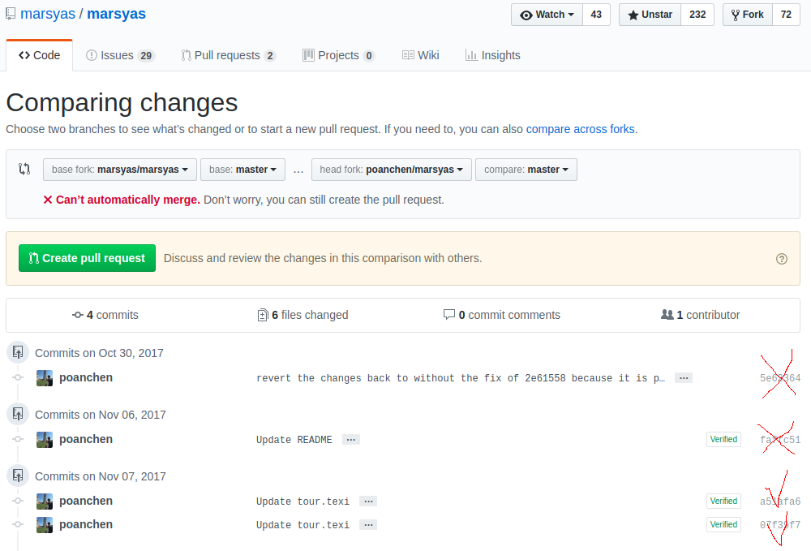
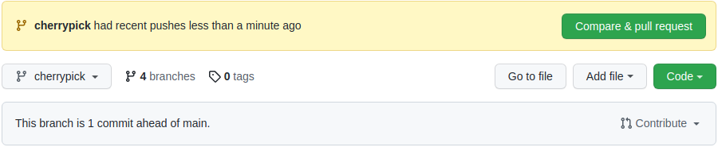

# Git cherry-pick

- Ref:

https://poanchen.github.io/blog/2017/11/12/How-to-create-a-GitHub-pull-request-with-a-specific-commits


## Cherry Picking in Github




The problem that I have here is that I only wanted to create a pull request with only the a51afa6 and 07f39f7. But, it seems like you cannot really do anything on the GitHub UI to remove it. You know why? Because you are not suppose to. You are suppose to create a branch with the latest changes and cherry-pick the ones that you want. And then compare that branch with the repository that you would like to contribute. The differences will only be the ones that you cherry-picked. Then, you are done. This is how you would create a GitHub pull request with a specific commits. Let me show you in action.


First, you need to create a branch with the latest changes (that is the same with the upstream remote branch)

  git fetch --all
  git checkout -b new-branch-name upstream/master


Note: The above assumes you’ve set up upstream as a remote. If not, do this first:

  git remote add upstream https://github.com/upstream_github_username/upstream_github_repo_name.git

  git remote add upstream https://github.com/oopsmails/react-sandbox.git


Next, you would need to cherry-pick the changes that you would like to include in the pull request.

  git cherry-pick a51afa6
  git cherry-pick 07f39f7

  git cherry-pick 259f2c85b3f89953b420e1b126993652596fba1a


Now, all you need to do is to push your changes to your GitHub repository

  git push -u origin new-branch-name

  git push -u origin cherrypick


Head over to your GitHub repository, and you should see this.



Recently pushed branch

Simply click Compare & pull request to create a pull request in the repository that you would like to contribute with only the changes you picked.


Tada. You have done it=)

## My Real Instruction


- Create a new branch *cherrypick* in github, then run

  git remote add upstream https://github.com/oopsmails/react-sandbox.git
  git checkout -b cherrypick upstream/cherrypick


```
albert@albert-mint20:~/Documents/dev/react/react-sandbox$ git remote add upstream https://github.com/oopsmails/react-sandbox.git

albert@albert-mint20:~/Documents/dev/react/react-sandbox$ git fetch --all
Fetching origin
From https://github.com/oopsmails/react-sandbox
 * [new branch]      cherrypick -> origin/cherrypick
Fetching upstream
From https://github.com/oopsmails/react-sandbox
 * [new branch]      202111-react-router-dom-5 -> upstream/202111-react-router-dom-5
 * [new branch]      202112-meetups-bootstrap  -> upstream/202112-meetups-bootstrap
 * [new branch]      cherrypick                -> upstream/cherrypick
 * [new branch]      main                      -> upstream/main

albert@albert-mint20:~/Documents/dev/react/react-sandbox$ git checkout -b cherrypick upstream/cherrypick
Branch 'cherrypick' set up to track remote branch 'cherrypick' from 'upstream'.
Switched to a new branch 'cherrypick'

```
- run *git cherry-pick <commit#>* and review the changes

```
albert@albert-mint20:~/Documents/dev/react/react-sandbox$ git cherry-pick 259f2c85b3f89953b420e1b126993652596fba1a
Removing meetups/README.md
[cherrypick 104ed05] 20220310: re-visiting
 Date: Thu Mar 10 09:44:58 2022 -0500
 2 files changed, 52 insertions(+), 70 deletions(-)
 create mode 100644 meetups/README-meetups.md
 delete mode 100644 meetups/README.md

 ```
- push to remote new branch 

```
albert@albert-mint20:~/Documents/dev/react/react-sandbox$ git push -u origin cherrypick
Enumerating objects: 6, done.
Counting objects: 100% (6/6), done.
Delta compression using up to 4 threads
Compressing objects: 100% (4/4), done.
Writing objects: 100% (4/4), 1.03 KiB | 1.03 MiB/s, done.
Total 4 (delta 2), reused 1 (delta 0)
remote: Resolving deltas: 100% (2/2), completed with 2 local objects.
To https://github.com/oopsmails/react-sandbox.git
   8785e70..104ed05  cherrypick -> cherrypick
Branch 'cherrypick' set up to track remote branch 'cherrypick' from 'origin'.
```

- Head over to your GitHub repository, and you should see this.


*Recently pushed branch*

Simply click *Compare & pull request* to create a pull request in the repository that you would like to contribute with only the changes you picked.

- Done, delete new branch if would like.


