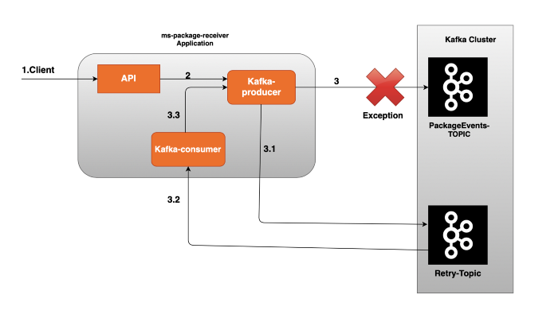
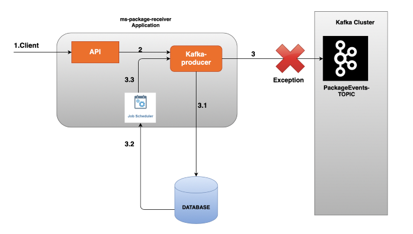

# Kafka Knowledge: Error Handling

- Ref:

https://emmadinishanth.medium.com/kafka-producer-error-handling-retry-and-recovery-5e4943c914e0

## Producer

### Approach 1




### Approach 2




Sample code snippet :

```

/*
    Here I am using kafkaTemplate sendDefault method to post the event to Kafka topic
This method gets the topic name from the properties file "spring.kafka.template.default-topic"
kafkaTemplate provides other overloaded methods to take more control by specifying. topic, partition, headers, event.
I like kafkaTemplate with producerRecord object

*/
ListenableFuture<SendResult<String, String>> sendResultListenableFuture = kafkaTemplate.sendDefault(key, value);


 /*
    kafkaTemplate's response is in the form of  ListenableFutureListenableFuture added with a call-back to gracefully handle success or failure

 */
    sendResultListenableFuture.addCallback(new ListenableFutureCallback<SendResult<String, String>>() {

        @Override
        public void onFailure(Throwable ex) {

            handleFailure(key,value, ex);

        }

        @Override
        public void onSuccess(SendResult<String, String> result) {

            handleSuccess(key,value,result);

        }
    });


}

private void handleSuccess(String key, String value, SendResult<String, String> result) {

    log.info("The record with key : {}, value : {} is produced sucessfullly to offset {}", key, value, result.getRecordMetadata().offset());

}

private void handleFailure(String key, String value, Throwable ex) {

    log.info("The record with key: {}, value: {} cannot be processed! caused by {}", key, value, ex.getMessage());
// Here you can implement the code to filter based on exception type and place the events on to a topic as the first approach or a database like the second approach.
}

```


## Consumer


