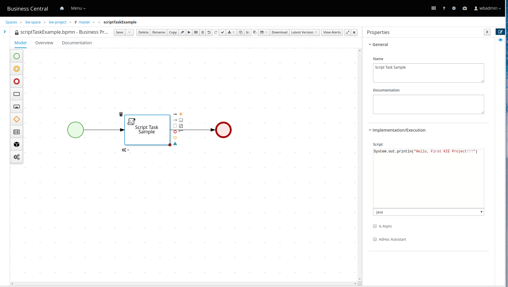

- [Learning jBPM](#learning-jbpm)
  - [Installation](#installation)
  - [Intros](#intros)
  - [Start](#start)
    - [Login](#login)
    - [Create Space, Project](#create-space-project)
    - [Create new Business Process](#create-new-business-process)
    - [Create new Data Object, as jBPM internal](#create-new-data-object-as-jbpm-internal)
    - [jBPM: using external model JARs](#jbpm-using-external-model-jars)


# Learning jBPM

- Ref

https://www.youtube.com/watch?v=sJ9YUzz2PGA

## Installation


1. Download and unzip it.
2. On Linux/Mac, run jbpm-server/bin/standalone.sh
3. On Windows, run jbpm-server/bin/standalone.bat
4. Open browser and go to http://localhost:8080/business-central
5. Login/password wbadmin/wbadmin

```
<system-properties>
    <property name="org.kie.server.id" value="sample-server"/>
............
    <property name="jboss.as.management.blocking.timeout" value="3600"/>  <-------------------- add this line
</system-properties>
```

## Intros

- There are three WARs under /jbpm/standalone/deployments

business-central.war, jbpm-casemgmt.war, and kie-server.war

## Start

### Login

http://localhost:8080/business-central

wbadmin/wbadmin

### Create Space, Project
create project

"Add Space"

click on space, "Add Project", DO NOT forget click on the link "Configure Advanced Options"!!!

This is the maven configuration of the project

Group ID
com.oopsmails.jbpm
Artifact ID
kie-project
Version
1.0.0-SNAPSHOT


### Create new Business Process

- Project, Settings, Deployments

General Settings, Runtime strategy, changed from "Singleton" to "Per process instance"

Save

- Project, Settings, Asset

"Add Asset", add "Business Process"

scriptTaskExample



- Project, build & install, deploy


**sample-server** is created in standalone.xml


- Manage Process


- Verify

```
10:47:00,649 INFO  [org.kie.server.controller.websocket.notification.WebSocketNotificationService] (Thread-199) WebSocket notification about change requested on server ServerTemplateKey{id='sample-server', name='sample-server'} with container spec ContainerSpec{releasedId=com.oopsmails.jbpm:kie-project:1.0.0-SNAPSHOT, configs={PROCESS=org.kie.server.controller.api.model.spec.ProcessConfig@cdea82e7, RULE=org.kie.server.controller.api.model.spec.RuleConfig@b764c7b}, status=STARTED} ContainerSpecKey{id='kie-project_1.0.0-SNAPSHOT', containerName='kie-project', serverTemplateKey=ServerTemplateKey{id='sample-server', name='sample-server'}} with following result [Container{serverInstanceId='sample-server@localhost:8080', resolvedReleasedId=com.oopsmails.jbpm:kie-project:1.0.0-SNAPSHOT, messages=[org.kie.server.api.model.Message@5d4da4d5], status=STARTED} ContainerKey{serverTemplateId='sample-server', containerSpecId='kie-project_1.0.0-SNAPSHOT', containerName='kie-project', url='http://localhost:8080/kie-server/services/rest/server/containers/kie-project_1.0.0-SNAPSHOT'}]
10:56:15,940 WARN  [org.kie.server.services.jbpm.ui.FormServiceBase] (default task-27) Unable to find form to render for process 'scriptTaskExample'
10:56:37,883 INFO  [stdout] (default task-27) Hello, First KIE Project!!!
```

- Menu, Track, Process Reports

- Menu, Manage, Execution Errors


### Create new Data Object, as jBPM internal

- Employee

com.oopsmails.jbpm.printdto.model.Employee

- Spaces  kie-space  print-dto   master   printEmployeeDetails Properties Process Data

Process Variables, Add +

- Task, script, java

com.oopsmails.jbpm.printdto.model.Employee empLocal = (com.oopsmails.jbpm.printdto.model.Employee)kcontext.getVariable("emp");
System.out.println("Employee name is:::"+empLocal.getName());

- Run "New Process Instance"


```
14:13:19,564 INFO  [stdout] (default task-51) Employee name is:::Albert
```

### jBPM: using external model JARs

- import Artifacts


- Go, project, Settings, Dependencies, Add from repository

/home/albert/Documents/ws/eclipse/jbpm/employ-dto/target/employee-model-0.0.1-SNAPSHOT.jar

com.oopsmails.jbpm.employee.model.Employee

add dependency employee-model

com.oopsmails.jbpm.employee.model.Employee empLocal = (com.oopsmails.jbpm.employee.model.Employee)kcontext.getVariable("emp");
System.out.println("Employee(Externam JAR) name is:::"+empLocal.getName());


com.oopsmails.jbpm.employee.model

com.oopsmails.jbpm.employee.model.Employee

com.oopsmails.jbpm.printdto.model

- Repo

file:///home/albert/repositories/kie/global/com/oopsmails/jbpm


