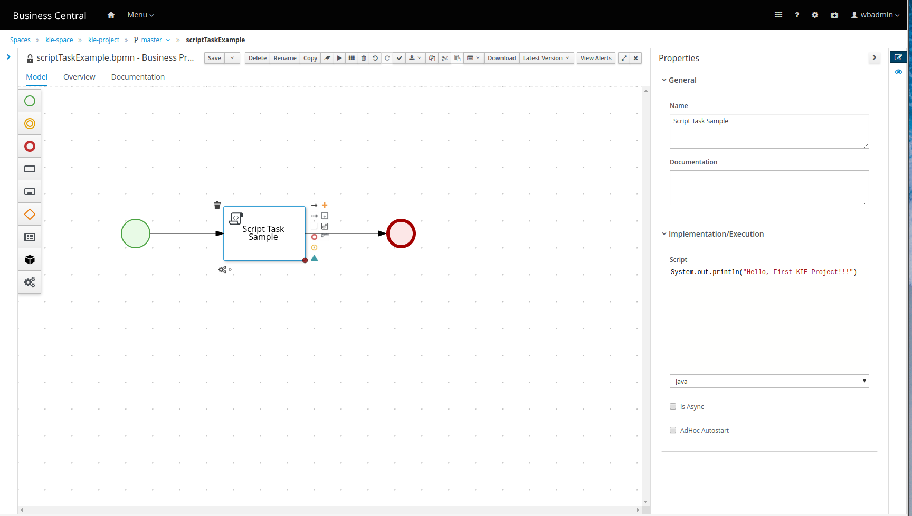
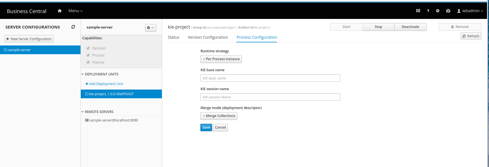
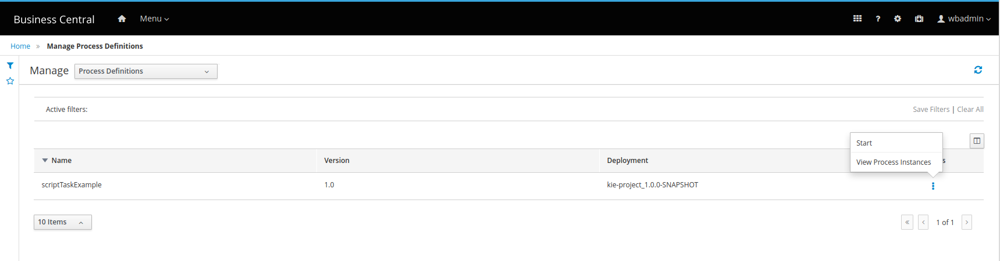
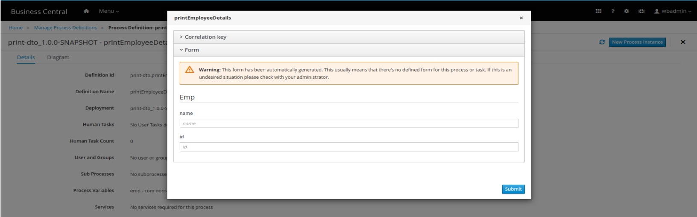

- [Learning jBPM](#learning-jbpm)
  - [Installation](#installation)
  - [Intros](#intros)
  - [Start](#start)
    - [Login](#login)
  - [Learning Notes](#learning-notes)
    - [Create Space, Project](#create-space-project)
    - [Unit 1: Create new Business Process](#unit-1-create-new-business-process)
    - [Unit 2: Create new Data Object, as jBPM internal](#unit-2-create-new-data-object-as-jbpm-internal)
    - [Unit 2: jBPM: using external model JARs](#unit-2-jbpm-using-external-model-jars)
    - [Unit 3: jBPM Gateways](#unit-3-jbpm-gateways)
    - [TBC Unit 4: jBPM Subprocess](#tbc-unit-4-jbpm-subprocess)
    - [Unit 5: jBPM Rest Service Task](#unit-5-jbpm-rest-service-task)
    - [TBC Unit 6: jBPM SOAP Service Task](#tbc-unit-6-jbpm-soap-service-task)
    - [Unit 7: jBPM Documents, Swagger API](#unit-7-jbpm-documents-swagger-api)


# Learning jBPM

- Ref

https://www.youtube.com/watch?v=sJ9YUzz2PGA

## Installation


1. Download and unzip it.
2. On Linux/Mac, run jbpm-server/bin/standalone.sh
3. On Windows, run jbpm-server/bin/standalone.bat
4. Open browser and go to http://localhost:8080/business-central
5. Login/password wbadmin/wbadmin

```
<system-properties>
    <property name="org.kie.server.id" value="sample-server"/>
............
    <property name="jboss.as.management.blocking.timeout" value="3600"/>  <-------------------- add this line
</system-properties>
```

## Intros

- There are three WARs under /jbpm/standalone/deployments

business-central.war, jbpm-casemgmt.war, and kie-server.war

## Start

### Login

http://localhost:8080/business-central

wbadmin/wbadmin

## Learning Notes

### Create Space, Project
create project

"Add Space"

click on space, "Add Project", DO NOT forget click on the link "Configure Advanced Options"!!!

This is the maven configuration of the project

Group ID
com.oopsmails.jbpm
Artifact ID
kie-project
Version
1.0.0-SNAPSHOT


### Unit 1: Create new Business Process

- Ref:

https://www.youtube.com/watch?v=sJ9YUzz2PGA

jBPM tutorial | JBPM Introduction | JBPM Setup | Script Task Example | Unit 1 | KIE TUTORIALS

- Project, Settings, Deployments

General Settings, Runtime strategy, changed from "Singleton" to "Per process instance"

Save

- Project, Settings, Asset

"Add Asset", add "Business Process"

scriptTaskExample



- Project, build & install, deploy


**sample-server** is created in standalone.xml




- Manage Process



- Verify

```
10:47:00,649 INFO  [org.kie.server.controller.websocket.notification.WebSocketNotificationService] (Thread-199) WebSocket notification about change requested on server ServerTemplateKey{id='sample-server', name='sample-server'} with container spec ContainerSpec{releasedId=com.oopsmails.jbpm:kie-project:1.0.0-SNAPSHOT, configs={PROCESS=org.kie.server.controller.api.model.spec.ProcessConfig@cdea82e7, RULE=org.kie.server.controller.api.model.spec.RuleConfig@b764c7b}, status=STARTED} ContainerSpecKey{id='kie-project_1.0.0-SNAPSHOT', containerName='kie-project', serverTemplateKey=ServerTemplateKey{id='sample-server', name='sample-server'}} with following result [Container{serverInstanceId='sample-server@localhost:8080', resolvedReleasedId=com.oopsmails.jbpm:kie-project:1.0.0-SNAPSHOT, messages=[org.kie.server.api.model.Message@5d4da4d5], status=STARTED} ContainerKey{serverTemplateId='sample-server', containerSpecId='kie-project_1.0.0-SNAPSHOT', containerName='kie-project', url='http://localhost:8080/kie-server/services/rest/server/containers/kie-project_1.0.0-SNAPSHOT'}]
10:56:15,940 WARN  [org.kie.server.services.jbpm.ui.FormServiceBase] (default task-27) Unable to find form to render for process 'scriptTaskExample'
10:56:37,883 INFO  [stdout] (default task-27) Hello, First KIE Project!!!
```

- Menu, Track, Process Reports

- Menu, Manage, Execution Errors


### Unit 2: Create new Data Object, as jBPM internal

- Ref:

https://www.youtube.com/watch?v=y1WQINvbnAM

jBPM Data Object | jBPM Tutorial | External Data Object As Maven Dependency | Unit 2 | KIE TUTORIALS

- Employee

com.oopsmails.jbpm.printdto.model.Employee

- Spaces  kie-space  print-dto   master   printEmployeeDetails Properties Process Data

Process Variables, Add +

- Task, script, java

com.oopsmails.jbpm.printdto.model.Employee empLocal = (com.oopsmails.jbpm.printdto.model.Employee)kcontext.getVariable("emp");
System.out.println("Employee name is:::"+empLocal.getName());

- Run "New Process Instance"




```
14:13:19,564 INFO  [stdout] (default task-51) Employee name is:::Albert
```

### Unit 2: jBPM: using external model JARs

- Ref:

https://www.youtube.com/watch?v=y1WQINvbnAM

jBPM Data Object | jBPM Tutorial | External Data Object As Maven Dependency | Unit 2 | KIE TUTORIALS

- import Artifacts


- Go, project, Settings, Dependencies, Add from repository

/home/albert/Documents/ws/eclipse/jbpm/employ-dto/target/employee-model-0.0.1-SNAPSHOT.jar

com.oopsmails.jbpm.employee.model.Employee

add dependency employee-model

com.oopsmails.jbpm.employee.model.Employee empLocal = (com.oopsmails.jbpm.employee.model.Employee)kcontext.getVariable("employee");
System.out.println("Employee(Externam JAR) name is:::"+empLocal.getName());


com.oopsmails.jbpm.employee.model

com.oopsmails.jbpm.employee.model.Employee

com.oopsmails.jbpm.printdto.model

- Repo

file:///home/albert/repositories/kie/global/com/oopsmails/jbpm


business process: bpmn, printExternalEmployeeModel
src/main/resources/com/oopsmails/jbpm/print_dto/printExternalEmployeeModel.bpmn

**Note:** 
Package still useing: com.oopsmails.jbpm.print_dto, ???, maybe can use other customerized ....

Process Variables: Don't reuse "emp" because it is already used by that internal print Asset.
employee - com.oopsmails.jbpm.employee.model.Employee


```

08:35:27,549 WARN  [org.appformer.maven.integration.MavenRepository] (default task-12) Unable to resolve artifact: null:null:null
08:35:43,533 WARN  [org.guvnor.m2repo.backend.server.M2RepoServiceImpl] (default task-12) The url null is not valid. Using the default.
08:35:43,533 ERROR [org.guvnor.m2repo.backend.server.M2RepoServiceImpl] (default task-12) The property org.appformer.m2repo.url is not correctly set. The workbench will use a direct file path to the m2 repository and this should only be used when test the workbench.
08:35:43,614 INFO  [org.guvnor.m2repo.backend.server.repositories.FileSystemArtifactRepository] (default task-12) Maven Repository root set to: repositories/kie/global/
```

### Unit 3: jBPM Gateways

- Ref:

https://www.youtube.com/watch?v=hAVGpiYn_hc

jBPM Gateways | Parallel Gateway | Inclusive Gateway | Exclusive Gateway | Unit 3 | KIE TUTORIALS

1. Parallel Gateway Example - It will activate           all outgoing nodes in parallel way
2. Inclusive Gateway Example - It will wait until all incoming nodes are completed
3. Exclusive Gateway Example - It will activate outgoing node based on condition

### TBC Unit 4: jBPM Subprocess

- Ref:

https://www.youtube.com/watch?v=8bqkGhkbHZQ

JBPM Subprocess | Reusable subprocess | Multiinstance subprocess | Unit 4 | KIE TUTORIALS


### Unit 5: jBPM Rest Service Task

https://www.youtube.com/watch?v=Zxyy-kThLWE

jBPM Rest Service Task | jBPM 7 tutorial | Unit 5 | KIE TUTORIALS


- Terms

Service Task, is also called Work Item Definitions, or Work Item Handler

- 6:54 of 13:49

Take google Rest example, see
https://github.com/kietutorials/jbpm-examples/blob/master/unit5-REST_SERVICETASK/src/main/resources/com/kie_space/unit5_rest_servicetask/Rest_Service_Task_Example.bpmn  

GET  

https://jsonplaceholder.typicode.com/todos/1  

- 9:59 of 13:49

To register RESTWorkItemHandler

Project, Settings, Deployments, Work item handlers, Add Work Item Handler


Name: Reat
Value: new org.jbpm.process.workitem.rest.RESTWorkItemHandler()
type: MVEL ... ???

- RESTWorkItemHandler, executeWorkItem() method, is actually a REST service call using HttpClient.

### TBC Unit 6: jBPM SOAP Service Task

- Ref

https://www.youtube.com/watch?v=A5rvLNmeRB4  
 
jBPM WebService Task | jBPM SOAP WebService Example | jBPM 7 Tutorial | Unit 6 | KIE TUTORIALS

### Unit 7: jBPM Documents, Swagger API

- Ref

https://www.youtube.com/watch?v=LtbnP9t6R2I

jBPM Documents | JBPM 7 Documents Swagger API | unit 7 | #KIE TUTORIALS

- Content

This video covers how to save document as process varaible  

- Single
new org.jbpm.document.marshalling.DocumentMarshallingStrategy();
org.jbpm.document.Document
-------DocumentStorageServiceImpl.class

- Multiple
new org.jbpm.document.marshalling.DocumentCollectionImplMarshallingStrategy(new org.jbpm.document.marshalling.DocumentMarshallingStrategy());
org.jbpm.document.DocumentCollection

- Custom
new org.jbpm.integration.cmis.impl.OpenCMISPlaceholderResolverStrategy();

- Set marshalling strategy

Project, Settings, Deployments, Marshalling Strategy, Add Marshalling Strategy
Name: new org.jbpm.document.marshalling.DocumentMarshallingStrategy();

folder: ??? jbpm/bin/.doc ???

- KIE server swagger

http://localhost:8080/kie-server/docs/

Search "Documents", can view all docs


