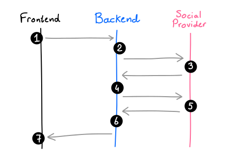

# Stateless OAuth2 Social Logins with Spring Boot

## Background

It's not too difficult to get started with a zero-config OAuth2 setup, but it turns out that there are a few quirks in the standard implementation:

- Spring Boot actually uses stateful HTTP sessions during the default authentication flow

- the default redirect flow can make it difficult to integrate from a mobile application or from a frontend hosted on a different domain

That's why this article will give an overview on how to make the authentication flow completely stateless and friendly towards any kind of client.

## Standard Login Flow

- The user clicks "Log in with Twitter" on your website and navigates to the backend authorization URL /oauth2/authorization/twitter
- The backend crafts the external authorization URL api.twitter.com/oauth/authorize?... and redirects the user there via HTTP status code 302
- The user arrives on the social provider's website, where they can authorize or deny the login request
- The user is sent back from Twitter to the backend callback URL /login/oauth2/code/twitter, at which point the backend picks out the authorization code URL query parameter set by Twitter, and sends it back to Twitter (along with an API key) in the background
- Twitter validates the authorization code and returns the social account details, like name, email, picture, etc.
- The backend finalizes the Twitter login (e.g. by registering the new user, sending a welcome e-mail, etc.)
- The user receives a cookie and is now logged in to your application

## Refs:

- https://www.jessym.com/articles/stateless-oauth2-social-logins-with-spring-boot

